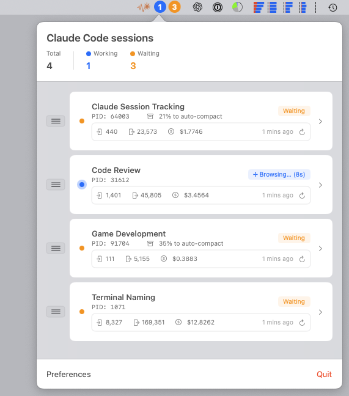
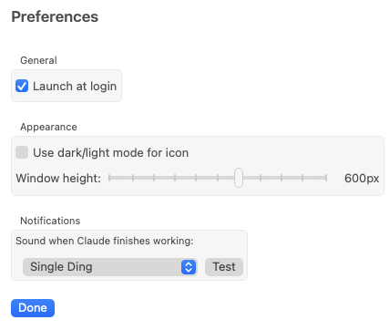

# Claude Code Monitor

A macOS menu bar application that monitors active Claude Code CLI sessions, providing real-time status updates, notifications when a Claude Code session finishes working and is waiting for you, some basic usage metrics, and quick access to jump to your Claude Code terminal windows.




Naturally, Claude Code did most of the work making this app.

## Features

### Real-Time Session Monitoring
- **Live Status Updates**: Shows which Claude sessions are currently working, waiting, or idle
- **Menu Bar Indicators**: Colored circles with counts (🔵 working, 🟠 waiting)
- **Working State Details**: Displays current operation (e.g., "Analyzing... (42s)")
- **Auto-Compaction Tracking**: Shows percentage until context window compaction

Note that the Claude sessions are named based on the terminal window name.  Claude Code will often update this window name to make sense contextually with the work you are doing, but you can also rename your terminal windows.

### Token Usage & Cost Tracking
- **Token Counting**: Tracks input and output tokens for each session
- **Cost Calculation**: Automatic pricing based on detected model (Opus, Sonnet, Haiku)
- **Manual Refresh**: Click the metrics area to update token counts (I did not automate this because it parses a large JSON file to tally the numbers, and I did not want this running constantly)
- **Last Updated Display**: Shows when metrics were last fetched

The token usage and cost tracking has not been vetted and may not be correct yet.  Also, the terminal window name is used to attempt to match against your ~/.claude/projects to find the appropriate JSONL file.  This is not working perfectly yet.  I would be happy to hear of some other more bullet-proof way to tie the Claude terminal session together with the JSONL file.

### Interactive Interface
- **Click to Focus**: Click any session to bring its terminal window to front
- **Drag & Drop Reordering**: Organize sessions in your preferred order
- **Sound Notifications**: Plays a sound when Claude finishes working (customizable)

### Preferences
- **Icon Style**: Toggle between template (adapts to menu bar) or colored icon
- **Window Height**: Adjustable popover height (300-800px)
- **Notification Sounds**: Choose from 30+ sound options or disable
- **Launch at Login**: Start automatically when you log in


## Installation

### Option 1: Build from Source
1. Clone this repository
2. Open `ClaudeCodeMonitor.xcodeproj` in Xcode
3. Select your development team (or use personal team)
4. Build and run (⌘+R)

### Option 2: Download Release
1. Download the latest `.app` from [Releases](https://github.com/marshmansf/claude-code-menu-bar/releases)
2. Move to Applications folder
3. Right-click and select "Open" (first time only, due to Gatekeeper)

## Usage

1. **Launch**: The app runs in your menu bar (look for the  icon)
2. **View Sessions**: Click the menu bar icon to see active sessions
3. **Focus Terminal**: Click any session to switch to its terminal window
4. **Refresh Metrics**: Click the metrics row to update token counts
5. **Reorder Sessions**: Drag the handle (≡) to reorder sessions
6. **Access Preferences**: Click the preferences button at the bottom

## How It Works

The app monitors Claude CLI processes by:
1. Scanning for `claude` processes using `ps` commands
2. Extracting terminal content via AppleScript (for iTerm2/Terminal.app)
3. Parsing working states using regex patterns
4. Reading JSONL files from `~/.claude/projects/` for token data
5. Calculating costs based on detected model pricing

## System Requirements

- macOS 13.0 (Ventura) or later
- Claude CLI installed and configured
- iTerm2 or Terminal.app

## Privacy & Security

- **Local Only**: All monitoring happens locally on your machine
- **No Network Calls**: No data is sent to external servers
- **Read-Only**: Only reads Claude's local files, never modifies them
- **Terminal Access**: Requires accessibility permissions for terminal content

## Troubleshooting

### App doesn't show sessions
- Ensure Claude CLI is running (`claude` command in terminal)
- Check that the app has accessibility permissions in System Settings

### Token counts show zero
- Click the refresh button to fetch latest data
- Ensure `~/.claude/` directory is accessible
- Some sessions may not have token data yet
- The Claude terminal session name to ~/.claude/projects JSONL file mapping technique is not bullet-proof and needs improvement

### Can't focus terminal windows
- Grant accessibility permissions when prompted
- Ensure using iTerm2 or Terminal.app

## Development

### Architecture
- **Language**: Swift 5 with SwiftUI
- **Frameworks**: AppKit, SwiftUI, Cocoa
- **Key Components**:
  - `SessionMonitor`: Core monitoring logic
  - `TerminalContentParser`: Extracts terminal states
  - `ClaudeFileParser`: Reads JSONL token data
  - `MenuBarView`: SwiftUI interface

### Building
```bash
# Clone repository
git clone https://github.com/marshmansf/claude-code-menu-bar.git
cd claude-code-menu-bar

# Open in Xcode
open ClaudeCodeMonitor.xcodeproj

# Or build from command line
xcodebuild -project ClaudeCodeMonitor.xcodeproj -scheme ClaudeCodeMonitor
```

## Contributing

Contributions are welcome! Please:
1. Fork the repository
2. Create a feature branch
3. Commit your changes
4. Push to the branch
5. Open a Pull Request

Put your Claude engines to work and enhance this tool!

## License

MIT License - see [LICENSE](LICENSE) file for details

## Acknowledgments

- Built for the Claude CLI community
- Icon design inspired by Anthropic's Claude
- Sound effects from freesound.org contributors; all sounds used are Creatives Commons 0 licensed